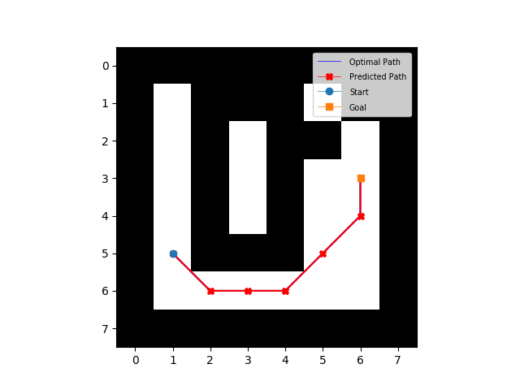

# VIN: [Value Iteration Networks](https://arxiv.org/abs/1602.02867)


## VIN key features
- A fully differentiable neural network with a 'planning' sub-module. 
- Value Iteration = Conv Layer + Channel-wise Max Pooling
- Generalize better than reactive policies for new, unseen tasks.

## Results
Visualization | Sample One | Sample Two
-- | --- | ---
8x8 |  | 

## Dependencies
This repository requires following packages:
- SciPy >= 0.19.0
- Python >= 3.6
- Numpy >= 1.12.1
- PyTorch >= 0.1.10
- Matplotlib >= 2.0.0

## How to train
#### 8x8 gridworld
```bash
python train.py --datafile dataset/gridworld_8x8.npz --imsize 8 --lr 0.005 --epochs 30 --k 10 --batch_size 128
```
#### 16x16 gridworld
```bash
python train.py --datafile dataset/gridworld_16x16.npz --imsize 16 --lr 0.002 --epochs 30 --k 20 --batch_size 128
```
#### 28x28 gridworld
```bash
python train.py --datafile dataset/gridworld_28x28.npz --imsize 28 --lr 0.002 --epochs 30 --k 36 --batch_size 128
```
**Flags**: 
- `datafile`: The path to the data files.
- `imsize`: The size of input images. One of: [8, 16, 28]
- `lr`: Learning rate with RMSProp optimizer. Recommended: [0.01, 0.005, 0.002, 0.001]
- `epochs`: Number of epochs to train. Default: 30
- `k`: Number of Value Iterations. Recommended: [10 for 8x8, 20 for 16x16, 36 for 28x28]
- `l_i`: Number of channels in input layer. Default: 2, i.e. obstacles image and goal image.
- `l_h`: Number of channels in first convolutional layer. Default: 150, described in paper.
- `l_q`: Number of channels in q layer (~actions) in VI-module. Default: 10, described in paper.
- `batch_size`: Batch size. Default: 128

## How to visualize / test paths (requires training first)
#### 8x8 gridworld
```bash
python test.py --weights trained/vin_8x8.pth --imsize 8 --k 10
```
#### 16x16 gridworld
```bash
python test.py --weights trained/vin_16x16.pth --imsize 16 --k 20
```
#### 28x28 gridworld
```bash
python test.py --weights trained/vin_28x28.pth --imsize 28 --k 36
```

## Datasets
Each data sample consists of an obstacle image and a goal image followed by the (x, y) coordinates of current state in the gridworld. 

Dataset size | 8x8 | 16x16 | 28x28
-- | -- | -- | --
Train set | 82775 | 720747 | Not-done-yet
Test set | 14169 | 121490 | Not-done-yet

## Notes
* This repository includes a full gridworld implementation similar to the [original VIN implementation](https://github.com/avivt/VIN). 
* The datasets (8x8, 16x16, and 28x28) included in this repository can be reproduced using the script: ```dataset/make_training_data.py```
  * Note that this script is not optimized and runs rather slowly (also uses a lot of memory :D)
