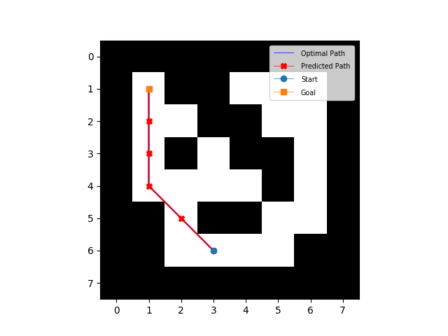
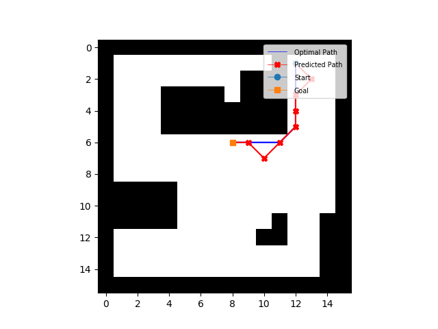
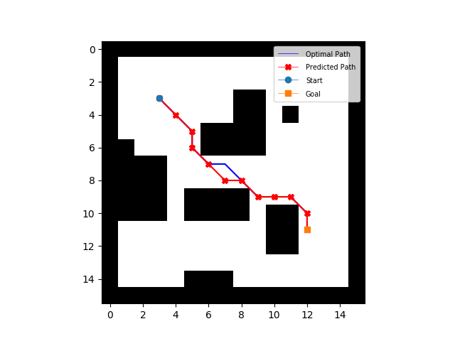
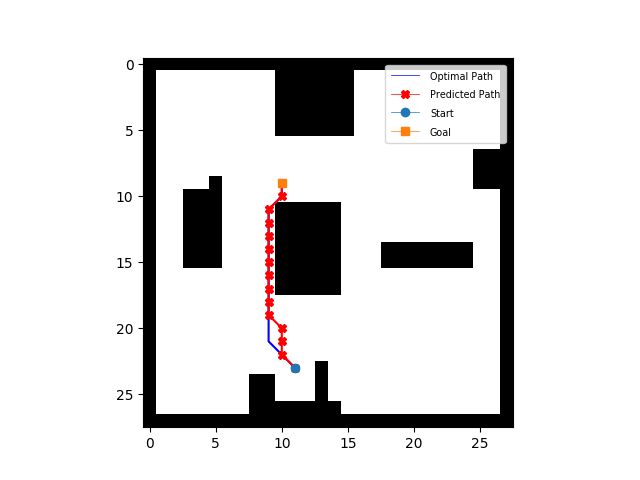
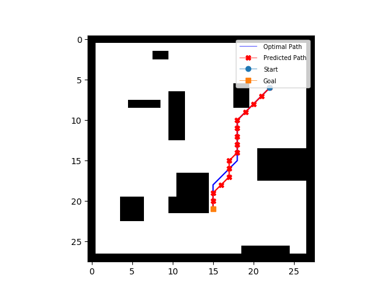

# VIN: [Value Iteration Networks](https://arxiv.org/abs/1602.02867)


## A quick thank you
A few others have released amazing related work which helped inspire and improve my own implementation. It goes without saying that this release would not be nearly as good if it were not for all of the following:
* [@avivt](https://github.com/avivt) ([Paper Author](https://arxiv.org/abs/1602.02867), [MATLAB implementation](https://github.com/avivt/VIN))
* [@zuoxingdong](https://github.com/zuoxingdong) ([Tensorflow implementation](https://github.com/zuoxingdong/VIN_TensorFlow), [Pytorch implementation](https://github.com/zuoxingdong/VIN_PyTorch_Visdom))
* [@TheAbhiKumar](https://github.com/TheAbhiKumar) ([Tensorflow implementation](https://github.com/TheAbhiKumar/tensorflow-value-iteration-networks))
* [@onlytailei](https://github.com/onlytailei) ([Pytorch implementation](https://github.com/onlytailei/Value-Iteration-Networks-PyTorch))

## Why another VIN implementation? 
1. The Pytorch VIN model in this repository is, in my opinion, more readable and closer to the original Theano implementation than others I have found (both Tensorflow and Pytorch). 
2. This is not simply an implementation of the VIN model in Pytorch, it is also a full Python implementation of the gridworld environments as used in the [original MATLAB implementation](https://github.com/avivt/VIN).
3. Provide a more extensible research base for others to build off of without needing to jump through the possible MATLAB paywall.

## Installation
This repository requires following packages:
- [SciPy](https://www.scipy.org/install.html) >= 0.19.0
- [Python](https://www.python.org/) >= 2.7 (if using Python 3.x: python3-tk should be installed)
- [Numpy](https://pypi.python.org/pypi/numpy) >= 1.12.1
- [Matplotlib](https://matplotlib.org/users/installing.html) >= 2.0.0
- [PyTorch](http://pytorch.org/) >= 0.1.11

Use `pip` to install the necessary dependencies:
```
pip install -U -r requirements.txt 
```
Note that PyTorch cannot be installed directly from PyPI; refer to http://pytorch.org/ for custom installation instructions specific to your needs. 
## How to train
#### 8x8 gridworld
```bash
python train.py --datafile dataset/gridworld_8x8.npz --imsize 8 --lr 0.005 --epochs 30 --k 10 --batch_size 128
```
#### 16x16 gridworld
```bash
python train.py --datafile dataset/gridworld_16x16.npz --imsize 16 --lr 0.002 --epochs 30 --k 20 --batch_size 128
```
#### 28x28 gridworld
```bash
python train.py --datafile dataset/gridworld_28x28.npz --imsize 28 --lr 0.002 --epochs 30 --k 36 --batch_size 128
```
**Flags**: 
- `datafile`: The path to the data files.
- `imsize`: The size of input images. One of: [8, 16, 28]
- `lr`: Learning rate with RMSProp optimizer. Recommended: [0.01, 0.005, 0.002, 0.001]
- `epochs`: Number of epochs to train. Default: 30
- `k`: Number of Value Iterations. Recommended: [10 for 8x8, 20 for 16x16, 36 for 28x28]
- `l_i`: Number of channels in input layer. Default: 2, i.e. obstacles image and goal image.
- `l_h`: Number of channels in first convolutional layer. Default: 150, described in paper.
- `l_q`: Number of channels in q layer (~actions) in VI-module. Default: 10, described in paper.
- `batch_size`: Batch size. Default: 128

## How to test / visualize paths (requires training first)
#### 8x8 gridworld
```bash
python test.py --weights trained/vin_8x8.pth --imsize 8 --k 10
```
#### 16x16 gridworld
```bash
python test.py --weights trained/vin_16x16.pth --imsize 16 --k 20
```
#### 28x28 gridworld
```bash
python test.py --weights trained/vin_28x28.pth --imsize 28 --k 36
```
To visualize the optimal and predicted paths simply pass:
```bash 
--plot
```

**Flags**: 
- `weights`: Path to trained weights.
- `imsize`: The size of input images. One of: [8, 16, 28]
- `plot`: If supplied, the optimal and predicted paths will be plotted 
- `k`: Number of Value Iterations. Recommended: [10 for 8x8, 20 for 16x16, 36 for 28x28]
- `l_i`: Number of channels in input layer. Default: 2, i.e. obstacles image and goal image.
- `l_h`: Number of channels in first convolutional layer. Default: 150, described in paper.
- `l_q`: Number of channels in q layer (~actions) in VI-module. Default: 10, described in paper.

## Results
Gridworld | Sample One | Sample Two
-- | --- | ---
8x8 |  | 
16x16 |  | 
28x28 |  | 

## Datasets
Each data sample consists of an obstacle image and a goal image followed by the (x, y) coordinates of current state in the gridworld. 

Dataset size | 8x8 | 16x16 | 28x28
-- | -- | -- | --
Train set | 81337 | 456309 | 1529584
Test set | 13846 | 77203 | 251755

The datasets (8x8, 16x16, and 28x28) included in this repository can be reproduced using the ```dataset/make_training_data.py``` script. Note that this script is not optimized and runs rather slowly (also uses a lot of memory :D)

## Performance: Success Rate
This is the success rate from rollouts of the learned policy in the environment (taken over 5000 randomly generated domains). 

Success Rate | 8x8 | 16x16 | 28x28
-- | -- | -- | --
PyTorch | 99.69% | 96.99% | 91.07%

## Performance: Test Accuracy

**NOTE**: This is the **accuracy on test set**. It is different from the table in the paper, which indicates the **success rate** from rollouts of the learned policy in the environment. 

Test Accuracy | 8x8 | 16x16 | 28x28
-- | -- | -- | --
PyTorch | 99.83% | 94.84% | 88.54%
